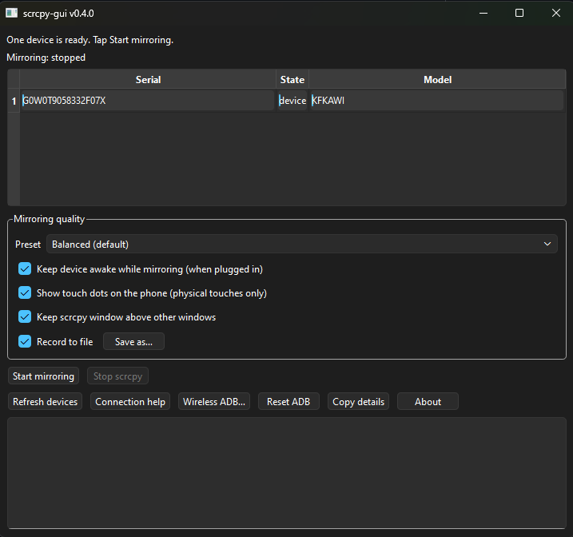

# scrcpy-gui

**scrcpy-gui** is a small, open-source **desktop** wrapper around **[scrcpy](https://github.com/Genymobile/scrcpy)** that helps **Windows** users go from *install* → *USB* → *mirror* without touching a terminal. **v1** targets **Windows 10/11**, with support for other operating systems potentially added later.

## UI preview



## What it does

- On first run, **downloads and caches** pinned versions of:
  - **Android platform-tools** (ADB) from Google  
  - **scrcpy** for Windows (zip from GitHub releases)  
- Lists **connected devices** (`adb devices` style).  
- **Connection help** (step-by-step USB debugging) and a **status line** that changes when the list is empty, `unauthorized`, `offline`, or not yet in the `device` state.  
- **Reset ADB** restarts the ADB server (`kill-server` / `start-server`) if the device list looks stuck.  
- Starts **one** scrcpy window. If **several** phones are in the `device` state, **select a row** in the table, then **Start mirroring**; with **one** ready device, you can start without choosing a row.  
- **Mirroring quality (v0.3+):** choose a **preset** (Balanced / Smoother / Sharper) and optional **Stay awake**, **Show touches**, **Always on top**; choices are **saved** for the next run (QSettings in your Windows user profile).  
- **Record to file (optional):** record the mirror session to a video file; the app remembers the last output folder, autogenerates names, and you can use **Save as…** to pick a path for the next start.  
- **v0.4:** **First-run download** shows **progress**; **Refresh** and ADB work **off the UI thread**; one **scrcpy** session with **Stop**, **separate “Mirroring: …”** status, and log **capped** for long runs; **title bar** and **About** show the version; device table has a **Model** column; **F5** / **Ctrl+Enter** refresh or start; **Wireless ADB…** runs **USB→tcpip** and **pair (Android 11+)** flows; **Connection help** includes a short wireless how-to.

## Requirements

- **Windows 10+** (v1).  
- A USB data cable, Android **USB debugging** enabled, and **accepting the USB debugging** prompt on the device.
- **Python 3.11+** when running from source.

## Quick start (end users)

1. Connect your phone with a data-capable USB cable.
2. Enable Android **Developer options** and **USB debugging**.
3. Tap **Refresh devices**.
4. If exactly one row is in `device` state, click **Start mirroring**.
5. If multiple rows are in `device` state, select one row first, then click **Start mirroring**.

If the app shows `unauthorized`, approve the USB debugging prompt on the phone and refresh again.

## Common workflows

- **Wireless ADB:** use **Wireless ADB…** for either USB->`tcpip` switch or Android 11+ pairing flow.
- **Recording:** enable **Record to file**, optionally choose **Save as…**, then start mirroring.
- **Quality/performance:** choose a preset:
  - **Balanced (default)**
  - **Smoother** (lower resolution, less bandwidth)
  - **Sharper** (higher resolution, more bandwidth)
- **Session options:** toggle **Keep device awake**, **Show touch dots**, and **Always on top**.
- **When ADB seems stuck:** use **Reset ADB** then **Refresh devices**.

## Keyboard shortcuts

- `F5`: Refresh device list
- `Ctrl+Enter`: Start mirroring (when allowed by current device state)

## Develop / run from source

```text
py -3.11 -m venv .venv
.\.venv\Scripts\activate
python -m pip install -U pip
python -m pip install -e ".[dev]"
python -m scrcpy_gui
```

(Use `python -m` if the `scrcpy-gui` entry script is not on your `PATH`.)

**Tests:** `python -m pytest -q`

**Lint:** `python -m ruff check .`

## Windows executable (optional)

With dev dependencies (`pyinstaller`), from the repository root (after `pip install -e ".[dev]"`).

**Application icon:** the repo includes `logo_ico.ico` at the root. Pass it to PyInstaller so Explorer, the taskbar, and shortcuts show your icon:

```text
--icon=logo_ico.ico
```

Use a multi-size `.ico` (for example 16, 32, 48, 256) for best results on HiDPI displays.

**Folder build** (default, `dist\scrcpy-gui\` with `scrcpy-gui.exe` and `_internal\`—ship the **whole** folder):

```text
py -m PyInstaller --noconfirm --windowed --name scrcpy-gui --icon=logo_ico.ico --add-data "src/scrcpy_gui/data;scrcpy_gui/data" src/scrcpy_gui/__main__.py
```

**Single file** (one `dist\scrcpy-gui.exe` to share; first launch may be slightly slower as PyInstaller unpacks to a temp dir):

```text
py -m PyInstaller --onefile --noconfirm --windowed --name scrcpy-gui --icon=logo_ico.ico --add-data "src/scrcpy_gui/data;scrcpy_gui/data" src/scrcpy_gui/__main__.py
```

If the GUI cannot find `vendor-windows.json` at runtime, add `--collect-data scrcpy_gui` (PyInstaller 6+) or list `scrcpy_gui` hidden imports in a `.spec` and rebuild.

**Windows installer (Inno Setup):** to package the PyInstaller output into a setup program (shortcuts, uninstall), see [docs/inno-setup.md](docs/inno-setup.md).

## Cache location

- Windows: under `%LOCALAPPDATA%\scrcpy-gui\cache\` (platform-tools and scrcpy folders).

## Troubleshooting

- **No devices found:** verify cable/port, USB mode (MTP/File transfer), then click **Refresh devices**.
- **`unauthorized` state:** accept **Allow USB debugging** prompt on phone, then refresh.
- **`offline` state:** try a different USB port/cable, then refresh.
- **Setup/listing failure on first run:** check the log area for download/ADB errors and retry.
- **Multiple ready devices:** select the correct row in the table before starting mirror.

## Project layout

- `src/scrcpy_gui/ui/`: main window and dialogs (about, wireless, connection help)
- `src/scrcpy_gui/adb.py`: ADB command helpers and device parsing
- `src/scrcpy_gui/download.py` + `src/scrcpy_gui/ensure.py`: first-run download and setup flow
- `src/scrcpy_gui/scrcpy_runner.py`: scrcpy process launch/stop + output piping
- `tests/`: automated tests

## Legal

- Project license: `LICENSE` (MIT) for *this* repository’s own code.  
- Third-party components: see [THIRD_PARTY_NOTICES.md](THIRD_PARTY_NOTICES.md).  
- This project is not affiliated with Genymobile, Google, or The Qt Company.

## Disclaimer

- Software is provided **as-is**, without warranty. Screen mirroring depends on ADB, drivers, and device settings; see the scrcpy project for upstream behavior and limitations.
